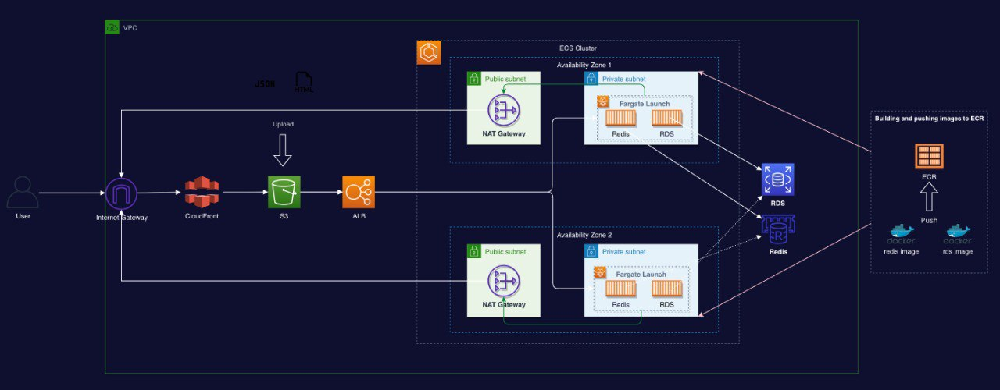
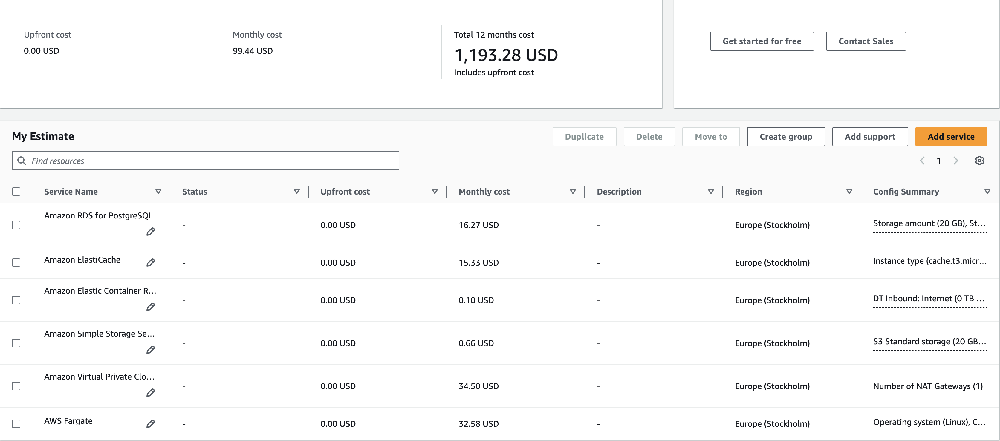

# Mobile Accessories Online Store

## Project Overview
This project is an online store for mobile accessories, focused on providing a scalable, budget-friendly, and secure platform. It combines a robust backend, a minimalist static frontend, and an API service to handle essential features such as user authentication, product listings, and order processing.

## Table of Contents
- [Project Overview](#project-overview)
- [Features](#features)
- [Architecture](#architecture)
- [Technologies Used](#technologies-used)
- [CI/CD Workflow](#cicd-workflow)
- [Cost Efficiency Strategy](#cost-efficiency-strategy)
- [Project Requirements](#project-requirements)
- [Authors](#authors)

---

## Features
- **Session Caching**: Improved performance with Redis caching for active sessions.
- **CI/CD Pipeline**: Automated deployment to streamline updates and releases.

## Architecture
The architecture is designed to be lightweight, secure, and scalable to handle regular traffic as well as peak periods.

### Backend Services
- **Compute Options**: Uses ECS based on the optimal performance-to-cost balance.
- **Database**: PostgreSQL for relational data storage, managing user data, product information, and order history.
- **Caching**: Redis for session caching to enhance user experience and reduce server load.

### Frontend
- **Static Content**: Served via a minimalist interface that displays static content, ensuring a responsive and fast-loading website.

### Deployment Strategy
- **Dockerized Services**: Every component is Dockerized, making scaling and deployment straightforward and reliable.
- **Automated CI/CD**: Efficient CI/CD setup enables quick and secure deployment of updates and new features.

## Technologies Used
- **AWS Services**: Amazon ECS, ALB, Internet Gateway, NAT Gateway, Amazon ECR, Amazon RDS (PostgreSQL), ElastiCache, CLoudWatch, Amazon S3, and CloudFront.
- **Docker**: For containerization and easy deployment of backend and caching services.
- **Redis**: For caching session data.
- **GitLab CI/CD**: To automate the deployment and testing process.

## CI/CD Workflow
The GitLab CI/CD pipeline automates the following:
- **Code Testing**: Automatically tests each commit to ensure code integrity.
- **Infrastructure Deployment**: Executes Terraform files to provision and manage AWS infrastructure automatically with each deployment.
- **Uploads frontend files to S3**: Uploads frontend files to S3, automatically changes the ALB dns names in config.json file.
- **Building Docker Images**: Builds Docker images for backend and caching services.
- **Puhing Images to ECR**: Pushes Docker images to Amazon ECR.
- **EC2 Pulls the Images from ECR**: Updates ECS task definition and forces a new deployment

## Cost Efficiency Strategy
The application is designed to operate under a strict monthly budget of $100. My infrastructure costs 99.94$/month:

## Project Requirements
- **Traffic Expectations**: Average of 3000 daily visits, peaking at 10,000 during sales.
- **Performance**: Minimum handling of 5 requests per second, with scalable options for peak periods.
- **Security**: Focus on securing customer data and safe handling of all transactions.

## Author
- **Marko Sakal** – [GitLab](https://gitlab.com/mqrkmontblanc) | [GitHub](https://github.com/markmontblanc) | [LinkedIn](https://www.linkedin.com/in/markosakal/)
